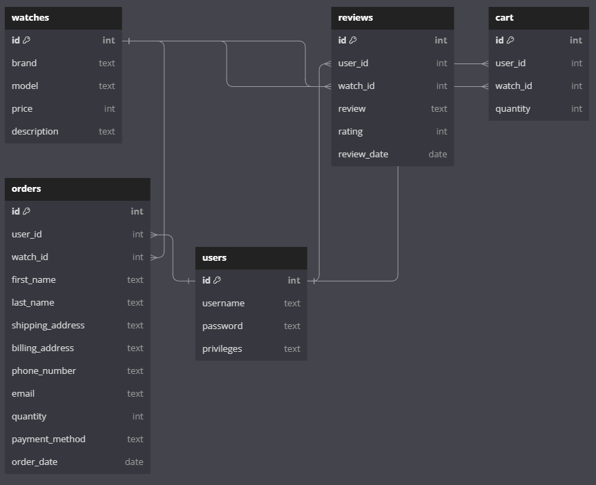

# Luxury watch e-commerce website

This project is an exercise for the course Databases and Web Programming at the University of Helsinki. It simulates a luxury watch e-commerce platform.

## Features

- **User Accounts**: Users can create accounts to log in and access additional functionalities.

- **Shopping Cart**: Logged-in users can add watches to their shopping cart for convenient checkout.

- **Mocked Payment System**: While not using real payment processing, the system is designed to simulate the purchase process. Real payment integration, e.g., with Stripe, could be implemented in the future.

- **Custom CSS Styling**: The project features custom CSS styling for a unique and visually appealing user interface.

- **Admin Panel**: An admin panel is provided, allowing authorized users to manage various aspects of the website, such as adding new watches and handling reviews.

- **User Reviews**: Authenticated users can provide reviews and ratings for watches, contributing to the overall user experience.

- **JavaScript for Dynamicality**: JavaScript is utilized to add dynamicality to the website, enhancing user interaction and providing a more seamless experience.

- **Responsive Design (Laptops and Larger Screens)**: While the project is designed to be responsive for laptops and larger screens, it is not fully optimized for mobile devices.

## Technologies used

- **Frontend**: HTML, CSS, JavaScript

- **Backend**: Python, Flask

- **Database**: PostgreSQL

## Database schema



## Installation guide

1. Clone this repository to your local machine:

   ```bash
   git clone https://github.com/LerkkaP/ecommerceFlask.git
   ```

2. Navigate to the project root

3. Create a .env file in the root directory of the project and add your environment variables:

   ```bash
   DATABASE_URL = your_local_database_url
   SECRET_KEY = your_secret_key
   ```

4. Activate virtual environment:

   ```bash
   python3 -m venv venv
   ```

   ```bash
   source venv/bin/activate
   ```

5. Install dependencies:

   ```bash
   pip install -r requirements.txt
   ```

6. Set up the database:

   ```bash
   psql < schema.sql
   ```

   ```bash
   psql < seed.sql
   ```

7. Run the application:

   ```bash
   python3 main.py
   ```
